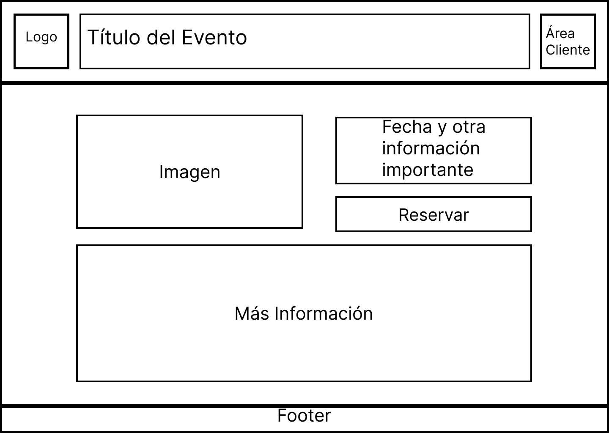

# Bocetos

A continuación se presentan algunos bocetos de las páginas más importantes de la web.

## Página Inicio

Esta sería la página principal que se mostraría al entrar a la web.

## Página Eventos

Esta sería la página de eventos, la cual muestra todos los eventos ordenados por fecha en una lista desplazable.

## Página Evento

Se muestra la página de un evento concreto, en la cual se ofrece más informacióna acerca del mismo.

## Página de Reserva

Se muestra a continuación el formulario que el usuario debería rellenar para reservar una mesa o un evento.  
En la parte derecha, se mostraría el horario del local o del evento, y una recomendación de a que hora/día reservar
en función de las necesidades del local y la disponibilidad.

## Área Cliente - Acceso

Aquí se muestra la página de registro/acceso junto con la newsletter.
El apartado de newsletter permanecerá fijo mientras que el de registro dependerá de si el usuario está o no logueado.

## Área Cliente - Mis datos

Aquí encontramos el apartado donde un usuario logueado puede ver y modificar sus datos.

## Área Cliente - Mis Código de invitación

Subpágina del área cliente donde se puede visualizar el código de invitación del usuario junto con los usos disponibles.
Además, aquí se explica el funcionamiento del sistema de invitación en el que cada usuario puede invitar a determinado número de nuevos usuarios.

