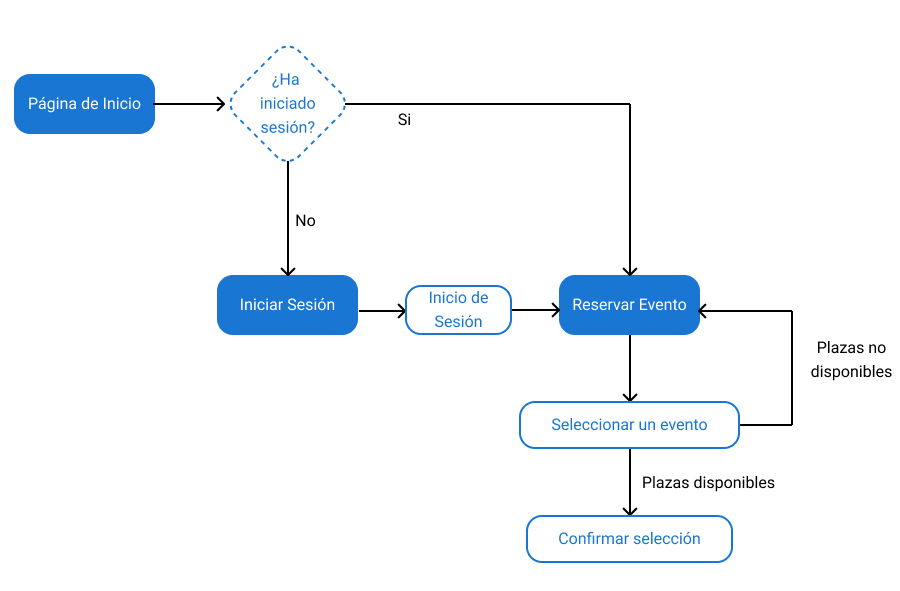

# Task Analysis

## User Task Matrix

Un "User Task Matrix" es una herramienta que nos servirá para organizar y  visualizar las tareas que podrán realizar los usuarios en nuestra página web. La utilizaremos para mostrar cuales serían las tareas que se podrían realizar y los usuarios que tendrían acceso a las mismas.  

Los usuarios tendríamos dos tipos, el básico y el premium. El segundo serían aquellos que pertenecen al grupo de clientes que se han registrado en la página a través de un código de invitación, para crear ese servicio de venta privada, o acceso privado, que se plantea en la malla receptora.

| Tareas       | Usuario Básico | Usuario  Premium |
|--------------|----------------|------------------|
| Consultar información | :write_check_mark: | :write_check_mark: |
| Consultar publicaciones | :write_check_mark: | :write_check_mark: |
| Registrarse (Con un código) | :write_check_mark: | :x: |
| Iniciar Sesión | :x: | :write_check_mark: |
| Subscribirse a la Newsletter | :write_check_mark: | :write_check_mark: |
| Consultar la galería de fotos | :write_check_mark: | :write_check_mark: |
| Reservar una mesa | :write_check_mark: | :write_check_mark: |
| Reservar plaza en una cata de vino o evento | :x: | :write_check_mark: |
| Cancelar reserva | :write_check_mark: | :write_check_mark: |

## Task Flow  

A continuación se mostrarán los Task Flow de algunas de las tareas que aparecen en la tabla anterior.  

El primer Task Flow abarca la operación de Reservar plaza en una cata de vino o evento. Podemos ver como para realizar tal acción, el usuario debe iniciar sesión obligatoriamente y una vez hecho esto, se le mostrarán los eventos y podrá inscribirse o reservar para alguno si es de su interés.  

  

En el segundo Task Flow se muestra como el usuario puede navergar por las publicaciones de la página principal y que ocurre al interaccionar con ellas. Estas publicaciones pueden dividirse en dos grupos, publicación normal, que serían aquellas en las que por ejemplo se comenta la existencia de nuevos vinos en la carta, se promociona una nueva tapa o se comparte una actualización en general del negocio. Las otras publicaciones son las de evento, que sirven para promocionar estos y ofrecer más información acerca de los mismos, como por ejemplo personas invitadas que acudirán o detalles sobre la fecha y la hora. Para facilitar la reserva de mesas o asistencias a eventos existirán enlaces directos desde las publicaciones para estas cuestiones, aunque si no está interesado el usuario siempre puede volver atrás.

