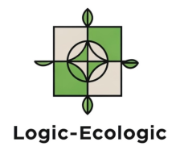

# Usability Report

#### Evaluación de usabilidad del proyecto 

### Logic-Ecologic

### 30/05/2025

https://github.com/RodriDeLo/UX_CaseStudy

### Realizado por:

Informe realizado por **Equipo GP**. Contamos con experiencia en diseño centrado en el usuario y validación de interfaces mediante testeo remoto. Este estudio se ha desarrollado dentro del marco del curso, con enfoque práctico en prototipado y evaluación de usabilidad.

## 1 DESCRIPCIÓN DEL WEBSITE

**Logic-Ecologic** es una aplicación web destinada a la compra de productos de alimentación online, con un enfoque en productos sostenibles locales de Granada. El objetivo de la plataforma es facilitar una experiencia de compra intuitiva, confiable y apoyando a productores responsables, accedediendo a alimentos frescos y de temporada, y contribuyendo activamente a un modelo de consumo más consciente, saludable y ecológico.

---

## 2 RESUMEN EJECUTIVO

Este documento recoge los resultados del test de usabilidad realizado sobre el prototipo **versión B** de Logic-Ecologic.
El diseño del proyecto B es **deficiente** y debería replantear el diseño desde 0 mejorando en gran medida algunos de los puntos siguientes:

**Resumen de problemas detectados:**

* Navegación compleja.
* Confianza moderada en el diseño para realizar compras.
* Los usuarios no encontraron todas las funcionalidades esperadas.

---

## 3 METODOLOGIA 

#### Metodología de usabililidad

Se utilizó la herramienta Maze para test remoto, combinando:

* Pregunta de filtrado inicial.
* Navegación libre del prototipo.
* Tarea específica: *añadir un producto a la cesta*.
* Cuestionario tipo Likert post-test.
* Cuestionario **SUS (System Usability Scale)**.

Duración promedio de la sesión: **76.8 segundos**

#### Test de usuarios: Participantes

| Usuario | Edad | Frecuencia de compra online | Nivel experiencia web | Observaciones                    |
| ------- | ---- | --------------------------- | --------------------- | -------------------------------- |
| U1      | 25   | Alta                        | Media                 | Baja confianza visual            |
| U2      | 22   | Alta                        | Alta                  | Valoró positivamente la estética |

Ambos usuarios confirmaron usar internet para compras o reservas habitualmente.

#### Resultados obtenidos

* **SUS Score promedio**: **51.25 / 100**
  Por debajo del estándar de referencia 68 → experiencia deficiente
* **Pruebas Eye Tracking**
Las pruebas de Eye Tracking muestran que los usuarios se centran en los puntos de interés pero aún así el diseño de la página no es lo suficientemente bueno o confiable como para obtener una buena puntuación.

## 4 CONCLUSIONES 

Las pruebas revelan una experiencia de usuario que necesita mucha mejora. Aunque el estilo visual no es del todo correcto (habiendo problemas de contraste con un estilo cargante y una paleta de color no muy acertada), los usuarios no reportaron sobrecarga de clics. La baja percepción de confianza y baja facilidad de navegación indica que el flujo debe optimizarse. Además, faltan funcionalidades clave para la correcta navegavilidad del prototipo.

#### Incidencias

* Tuvimos que incluir manualmente el test de un participante debido a un error humano.
* Tamaño de muestra reducido (2 participantes).

#### Valoración 

* **Puntos positivos:**

  * Diseño visual coherente con el tipo de negocio.
  * Buena experiencia al completar la acción principal (añadir a la cesta).
  * Se deben realizar pocos clicks para acceder a las funcionalidades principales.

#### Recomendaciones y propuesta de mejoras: 

* Aumentar los elementos que refuercen la **confianza visual** (colores, mensajes de seguridad, elementos de reputación).
* Incluir **indicadores de progreso** y mensajes más claros en la navegación.
* Mejorar el contraste y identidad visual general de la Web.
* Mejorar el navbar para simplificar el menú superior que se ve muy cargado.

#### Valoración de la prueba de usabilidad (self-assesment)

Esta prueba ha sido altamente útil para detectar **problemas de usabilidad** que tal vez no eran evidentes a simple vista. Herramientas como Maze, combinadas con el cuestionario SUS, permiten validar hipótesis de diseño de forma rápida y eficaz incluso con pocos participantes.
