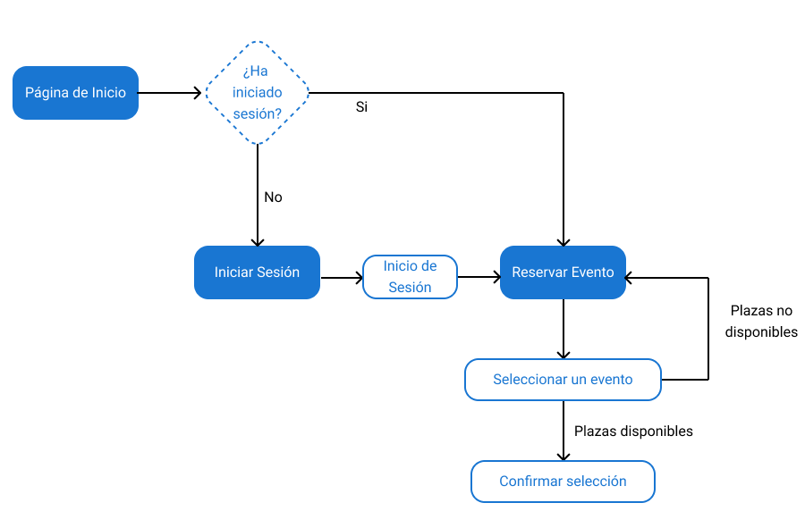
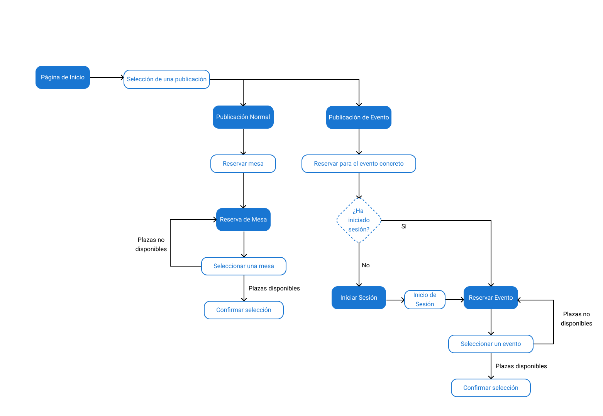

# DIU25

Prácticas Diseño Interfaces de Usuario (Tema: Gastronomía, Ocio y Degustación)

[Guiones de prácticas](GuionesPracticas/)

Grupo: DIU2_GP.  Curso: 2024/25

Actualizado: 07/03/2025

Proyecto:

>>> Decida el nombre corto de su propuesta en la práctica 2

Descripción:

>>> Describa la idea de su producto en la práctica 2

Logotipo:

>>> Si diseña un logotipo para su producto en la práctica 3 pongalo aqui, a un tamaño adecuado. Si diseña un slogan añadalo aquí

Miembros:

* :bust_in_silhouette:  Germán Vega Avila     :octocat:    <https://github.com/germanvegaa>
* :bust_in_silhouette:  Pablo Del Río López     :octocat:    <https://github.com/pdrl02>

# Proceso de Diseño

 

## Paso 1. UX User & Desk Research & Analisis

### 1.a User Reseach Plan

#### 1 Introducción

Granada es un referente en cultura y ocio, y la gastronomía juega un papel clave. Dentro de este mercado las nuevas tecnologías pueden ser muy útiles para muchos negocios. Así, la interacción entre las personas y los servicios de información que estas empresas ponen a disposición de los mismos es muy importante. Durante esta práctica nos centraremos en analizar este sector y en estudiar diferentes métodos para estudiar la usabilidad.

#### 2 Objetivos Principales

Existirían dos objetivos principales, el estudio del sector de la gastronomía como una forma de ocio, y el análisis de diferentes métodos y tecnología para estudiar la usabilidad de los diferentes diseños de las interfaces de usuario.

#### 3 Estrategia

Utilizaremos diferentes técnicas.  
Para estudiar el sector del ocio de desgustación, nos centraremos en:  

* Investigar el mercado: Principalmente a través de la visita a diferentes establecimientos y las entrevistas a trabajadores y propietarios de los negocios para conocer su visión.
* Realizar observaciones de los eventos, promociones, festivales... para prestar especial atención a las opiniones de los clientes y obtener un perfil de los mismos.  

Para conocer diferentes herramientas para analizar la usabilidad consultaremos:  

* Artículos de investigación, en páginas como Google Scholar o ResearchGate, acerca de la evaluación de la experiencia de usuario.  
* Libros, manuales y páginas de referencia, como "Dont Make Me Think".  

#### 4 Conocimiento previo

Partimos de unos conocimientos limitados sobre las dos área clave, pues no frecuentamos este tipo de establecimientos, aunque sí es cierto que hemos implementado algunas interfaces de usuario básicas en otros proyectos y tenemos unos conocimientos básicos en esta área.  

-----

### 1.b Competitive Analysis

Empezando por las características comunes de los sitios Web que debemos estudiar, debemos destacar que varios de los negocios propuestos no cuentan con página web propia, sino que para conectar con el público realizan publicaciones en diferentes redes sociales. Estas publicaciones están sobretodo enfocadas a difundir las diferentes actividades y experencias culinarias que proponen. Aquellos negocios que si cuentan con páginas propias, las utilizan de forma similar, aunque ofrecen más servicios como sistemas de reserva.  

En nuestro caso hemos seleccionado "La Taberna De Kafka", un negocio que no cuenta con página propia pero que cuida en cierta medida su imagen en las redes sociales. Creemos que es una buena opción ya que nos permitirá definir hasta que punto es negativo no contar con una web propia, además de comparar los diferentes estilos de comunicación a través de las redes sociales. Para la comparación, utilizaremos una tabla que muestre aspectos acerca de el modelo de negocio, problemas tecnológicos, funcionalidad, usabilidad y fortalezas y debilidades de los mismos.  

Como conclusión, podemos afirmar que contar con una página web bien actualizada y funcional es de gran ayuda. Así, creemos que la Taberna De Kafka no está desarrollando esta faceta correctamente, pues muchos de sus competidores cuentan con webs con muchas funcionalidades como la reserva, consulta de precios, consulta de cartas... Por otro lado, debemos darle el punto de las redes sociales a la taberna, pues de las consultadas es la única que mantiene actualizadas sus redes sociales.

-----

### 1.c Personas

Por un lado, tenemos a Natalia, una chica joven, interesada en la cultura, que vive en Granada, y frecuenta asiduamente estos locales en busca de experiencias enriquecedoras que sean una inspiración para su trabajo de guionista. Aunque es sociable, no muchas de sus amistades aprecian ese lado creativo, por lo que estos lugares le ayudan a conectar con personas que también les interesa el arte y la cultura.  

  

Por otro lado tenemos a Emily, una mujer de 34 años inglesa, que viene a Granada de turista en busca de experiencias gastronómicas y culturalesauténticas. Ha visitado España varias veces y está enamorada de la comida mediterránea. Ahora ha decidido explorar Granada para descubrir su historia, sus tapas y sus vinos.

  

-----

### 1.d User Journey Map

Para el primer jouney map hemos seleccionado una experiencia de usuario en la que Natalia, una chica de la zona, decide acudir para desconectar de su trabajo y conocer gente nueva. Lo hemos seleccionado porque representa a la clienta local que busca una experiencia gastronómica y cultural única. Así, podemos observar los intereses del cliente habitual que valora la oferta cultural y gastronómica y la opción de socializar.  

  

Para el segundo jounery map hemos descrito una experiencia de usuario de Emily, una turista británica. Emily decide acudir a la taberna para descubrir la gastronomía local y vivir una experiencia auténtica. Representa a la clienta extranjera que busca una inmersión cultural a través de la comida. Así, podemos observar los intereses del turista gastronómico que valora la autenticidad, la historia detrás de los platos y la posibilidad de compartir su experiencia en redes sociales y blogs de viajes.

  

-----

### 1.e Usability Review

Tras realizar la revisión de usabilidad podemos concluir que las páginas son correctas en la parte de navegabilidad, funcionanmiento, errores y control, pero estas partes de cierta forma son las correspondientes al marco básico que ofrecen las redes sociales. Por otro lado, flaquea en la búsqueda, la existencia de formularios y procesos y funcionalidades adicionales, para realizar por ejemplo reservas. Creemos que deben centrarse en mejorar estos aspectos y formalizar y mejorar el diseño de las publicaciones para crear una estética acorde a la oferta en sus perfiles.

Enlace al documento: [PDF](./P1/usability_review.pdf) / [Excel](./P1/Usability-review.xlsx)
URL de los lugares seleccionados:  

* <https://www.instagram.com/latabernadekafka/>  
* <https://www.facebook.com/laTabernadeKafka/?locale=es_ES>  

Valoración numérica obtenida: 49 Moderate  

-----

### 1.f Briefing

Tras realizar este estudio y revisión de la usabilidad, hemos llegado a las siguientes conclusiones:

* **Presencia digital limitada**: La Taberna de Kafka es un referente gastronómico en Granada, pero actualmente **no cuenta con una página web**, lo que restringe su capacidad para atraer clientes potenciales, especialmente turistas que buscan información en línea antes de decidir dónde comer.

* **Competencia con funcionalidades avanzadas**: Algunos de sus competidores ofrecen sitios web con **reservas online, consulta de cartas y precios**, lo que facilita la experiencia del usuario y optimiza el proceso de toma de decisiones.

* **Fortaleza en redes sociales**: A diferencia de sus competidores, la taberna mantiene **redes sociales actualizadas**, lo que le permite conectar con su comunidad y compartir novedades. Sin embargo, esto no sustituye la necesidad de una web bien estructurada.

Contar con una **página web funcional y actualizada** permitiría a la Taberna de Kafka **mejorar su accesibilidad, diferenciarse de la competencia y optimizar la experiencia del cliente** desde el primer punto de contacto.

-----

 

## Paso 2. UX Design  

### 2.a IDEACION: Feedback Capture Grid

A partir de la práctica anterior, en la que analizamos la experiencia de usuario, hemos identificado tanto aspectos positivos como negativos en la accesibilidad e información que muestra el local en internet. Entre los positivos, podemos destacar que utilizan las redes sociales a menudo, es fácil encontrarlos y contactar, sim embargo, no cuentan con opciones de reserva online ni ofrecen más información como podría ser la carta del local. Para tratar estos problemas proponemos el desarrollo de una página web propia que permita ofrecer todo este tipo de servicios y mejorar así la experiencia del usuario.  

Para organizar todos estos aspectos hemos creado una malla receptora con todas estas ideas.  
  

Podemos por tanto concluir que el principal problema en la experiencia de usuario es que se limita únicamente a la consulta de información, que en ocasiones puede estar desactualizada, y ni siquiera se ofrecen filtros para la búsqueda.  
Nuestra propuesta de valor consiste por tanto en crear una página web propia que permita:  

* Reservar a través de la web  
* Acceder a información acerca del local en tiempo real (espacio disponible, aviso de productos agotados, tiempo de espera para entrar, nivel de ruido...)
* Implementar un servicio exclusivo basado en invitaciones, parecido a BestSecret o Veepee.
* Mostrar menús y precios así como recomendaciones y enlaces a otros sitios de interés relacionados.  

### 2.b ScopeCanvas

>>> Propuesta de valor, pero ahora en vez de un texto es un ScopeCanvas que has subido a P2/ y enlazado desde aqui. Tambien vale una imagen miniatura del recurso.
>>> No olvides que tu propuesta ya tiene un nombre corto y puedes actualizar la cabecera de este archivo

### 2.b User Flow (task) analysis

#### User Task Matrix

Un "User Task Matrix" es una herramienta que nos servirá para organizar y  visualizar las tareas que podrán realizar los usuarios en nuestra página web. La utilizaremos para mostrar cuales serían las tareas que se podrían realizar y los usuarios que tendrían acceso a las mismas.  

Los usuarios tendríamos dos tipos, el básico y el premium. El segundo serían aquellos que pertenecen al grupo de clientes que se han registrado en la página a través de un código de invitación, para crear ese servicio de venta privada, o acceso privado, que se plantea en la malla receptora.

| Tareas       | Usuario Básico | Usuario  Premium |
|--------------|----------------|------------------|
| Consultar información | :write_check_mark: | :write_check_mark: |
| Consultar publicaciones | :write_check_mark: | :write_check_mark: |
| Registrarse (Con un código) | :write_check_mark: | :x: |
| Iniciar Sesión | :x: | :write_check_mark: |
| Subscribirse a la Newsletter | :write_check_mark: | :write_check_mark: |
| Consultar la galería de fotos | :write_check_mark: | :write_check_mark: |
| Reservar una mesa | :write_check_mark: | :write_check_mark: |
| Reservar plaza en una cata de vino o evento | :x: | :write_check_mark: |
| Cancelar reserva | :write_check_mark: | :write_check_mark: |

#### Task Flow  

A continuación se mostrarán los Task Flow de algunas de las tareas que aparecen en la tabla anterior.  

El primer Task Flow abarca la operación de Reservar plaza en una cata de vino o evento. Podemos ver como para realizar tal acción, el usuario debe iniciar sesión obligatoriamente y una vez hecho esto, se le mostrarán los eventos y podrá inscribirse o reservar para alguno si es de su interés.  

  

En el segundo Task Flow se muestra como el usuario puede navergar por las publicaciones de la página principal y que ocurre al interaccionar con ellas. Estas publicaciones pueden dividirse en dos grupos, publicación normal, que serían aquellas en las que por ejemplo se comenta la existencia de nuevos vinos en la carta, se promociona una nueva tapa o se comparte una actualización en general del negocio. Las otras publicaciones son las de evento, que sirven para promocionar estos y ofrecer más información acerca de los mismos, como por ejemplo personas invitadas que acudirán o detalles sobre la fecha y la hora. Para facilitar la reserva de mesas o asistencias a eventos existirán enlaces directos desde las publicaciones para estas cuestiones, aunque si no está interesado el usuario siempre puede volver atrás.

### 2.c IA: Sitemap + Labelling

Diagrama tipo Sitemap de la página y tabla de Labelling asociada al mismo:

  

### 2.d Wireframes

-----

>>> Plantear el diseño del layout para Web/movil (organización y simulación). Describa la herramienta usada

 

## Paso 3. Mi UX-Case Study (diseño)

>>> Cualquier título puede ser adaptado. Recuerda borrar estos comentarios del template en tu documento

### 3.a Moodboard

-----

>>> Diseño visual con una guía de estilos visual (moodboard)
>>> Incluir Logotipo. Todos los recursos estarán subidos a la carpeta P3/
>>> Explique aqui la/s herramienta/s utilizada/s y el por qué de la resolución empleada. Reflexione ¿Se puede usar esta imagen como cabecera de Instagram, por ejemplo, o se necesitan otras?

### 3.b Landing Page

----

>>> Plantear el Landing Page del producto. Aplica estilos definidos en el moodboard

### 3.c Guidelines

----

>>> Estudio de Guidelines y explicación de los Patrones IU a usar
>>> Es decir, tras documentarse, muestre las deciones tomadas sobre Patrones IU a usar para la fase siguiente de prototipado.

### 3.d Mockup

----

>>> Consiste en tener un Layout en acción. Un Mockup es un prototipo HTML que permite simular tareas con estilo de IU seleccionado. Muy útil para compartir con stakeholders

### 3.e ¿My UX-Case Study?

-----

>>> Publicar my Case Study en Github... Es el momento de dejar este documento para que sea evaluado y calificado como parte de la práctica
>>> Documente bien la cabecera y asegurese que ha resumido los pasos realizados para el diseño de su producto

 

## Paso 4. Pruebas de Evaluación

### 4.a Reclutamiento de usuarios

-----

>>> Breve descripción del caso asignado (llamado Caso-B) con enlace al repositorio Github
>>> Tabla y asignación de personas ficticias (o reales) a las pruebas. Exprese las ideas de posibles situaciones conflictivas de esa persona en las propuestas evaluadas. Mínimo 4 usuarios: asigne 2 al Caso A y 2 al caso B.

| Usuarios | Sexo/Edad     | Ocupación   |  Exp.TIC    | Personalidad | Plataforma | Caso
| ------------- | -------- | ----------- | ----------- | -----------  | ---------- | ----
| User1's name  | H / 18   | Estudiante  | Media       | Introvertido | Web.       | A
| User2's name  | H / 18   | Estudiante  | Media       | Timido       | Web        | A
| User3's name  | M / 35   | Abogado     | Baja        | Emocional    | móvil      | B
| User4's name  | H / 18   | Estudiante  | Media       | Racional     | Web        | B

### 4.b Diseño de las pruebas

-----

>>> Planifique qué pruebas se van a desarrollar. ¿En qué consisten? ¿Se hará uso del checklist de la P1?

### 4.c Cuestionario SUS

----

>>> Como uno de los test para la prueba A/B testing, usaremos el **Cuestionario SUS** que permite valorar la satisfacción de cada usuario con el diseño utilizado (casos A o B). Para calcular la valoración numérica y la etiqueta linguistica resultante usamos la [hoja de cálculo](https://github.com/mgea/DIU19/blob/master/Cuestionario%20SUS%20DIU.xlsx). Previamente conozca en qué consiste la escala SUS y cómo se interpretan sus resultados
<http://usabilitygeek.com/how-to-use-the-system-usability-scale-sus-to-evaluate-the-usability-of-your-website/>)
Para más información, consultar aquí sobre la [metodología SUS](https://cui.unige.ch/isi/icle-wiki/_media/ipm:test-suschapt.pdf)
>>> Adjuntar en la carpeta P4/ el excel resultante y describa aquí la valoración personal de los resultados

### 4.d A/B Testing

-----

>>> Los resultados de un A/B testing con 3 pruebas y 2 casos o alternativas daría como resultado una tabla de 3 filas y 2 columnas, además de un resultado agregado global. Especifique con claridad el resultado: qué caso es más usable, A o B?

### 4.e Aplicación del método Eye Tracking

----

>>> Indica cómo se diseña el experimento y se reclutan los usuarios. Explica la herramienta / uso de gazerecorder.com u otra similar. Aplíquese únicamente al caso B.

  
>>> Cambiar esta img por una de vuestro experimento. El recurso deberá estar subido a la carpeta P4/  

>>> gazerecorder en versión de pruebas puede estar limitada a 3 usuarios para generar mapa de calor (crédito > 0 para que funcione)

### 4.f Usability Report de B

-----

>>> Añadir report de usabilidad para práctica B (la de los compañeros) aportando resultados y valoración de cada debilidad de usabilidad.
>>> Enlazar aqui con el archivo subido a P4/ que indica qué equipo evalua a qué otro equipo.

>>> Complementad el Case Study en su Paso 4 con una Valoración personal del equipo sobre esta tarea

 

## Paso 5. Exportación y Documentación

### 5.a Exportación a HTML/React

----

>>> Breve descripción de esta tarea. Las evidencias de este paso quedan subidas a P5/

### 5.b Documentación con Storybook

----

>>> Breve descripción de esta tarea. Las evidencias de este paso quedan subidas a P5/

 

## Conclusiones finales & Valoración de las prácticas

>>> Opinión FINAL del proceso de desarrollo de diseño siguiendo metodología UX y valoración (positiva /negativa) de los resultados obtenidos. ¿Qué se puede mejorar? Recuerda que este tipo de texto se debe eliminar del template que se os proporciona
