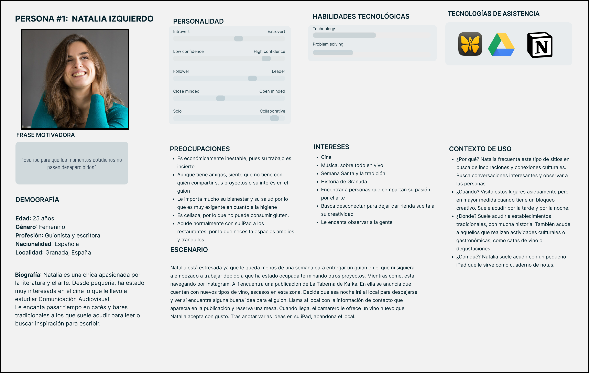

# DIU25

Prácticas Diseño Interfaces de Usuario (Tema: Gastronomía, Ocio y Degustación)

[Guiones de prácticas](GuionesPracticas/)

Grupo: DIU2_GP.  Curso: 2024/25

Actualizado: 07/03/2025

Proyecto:

>>> Decida el nombre corto de su propuesta en la práctica 2

Descripción:

>>> Describa la idea de su producto en la práctica 2

Logotipo:

>>> Si diseña un logotipo para su producto en la práctica 3 pongalo aqui, a un tamaño adecuado. Si diseña un slogan añadalo aquí

Miembros:

* :bust_in_silhouette:  Germán Vega Avila     :octocat:    <https://github.com/germanvegaa>
* :bust_in_silhouette:  Pablo Del Río López     :octocat:    <https://github.com/pdrl02>

# Proceso de Diseño

 

## Paso 1. UX User & Desk Research & Analisis

### 1.a User Reseach Plan

#### 1 Introducción

Granada es un referente en cultura y ocio, y la gastronomía juega un papel clave. Dentro de este mercado las nuevas tecnologías pueden ser muy útiles para muchos negocios. Así, la interacción entre las personas y los servicios de información que estas empresas ponen a disposición de los mismos es muy importante. Durante esta práctica nos centraremos en analizar este sector y en estudiar diferentes métodos para estudiar la usabilidad.

#### 2 Objetivos Principales

Existirían dos objetivos principales, el estudio del sector de la gastronomía como una forma de ocio, y el análisis de diferentes métodos y tecnología para estudiar la usabilidad de los diferentes diseños de las interfaces de usuario.

#### 3 Estrategia

Utilizaremos diferentes técnicas.  
Para estudiar el sector del ocio de desgustación, nos centraremos en:  

* Investigar el mercado: Principalmente a través de la visita a diferentes establecimientos y las entrevistas a trabajadores y propietarios de los negocios para conocer su visión.
* Realizar observaciones de los eventos, promociones, festivales... para prestar especial atención a las opiniones de los clientes y obtener un perfil de los mismos.  

Para conocer diferentes herramientas para analizar la usabilidad consultaremos:  

* Artículos de investigación, en páginas como Google Scholar o ResearchGate, acerca de la evaluación de la experiencia de usuario.  
* Libros, manuales y páginas de referencia, como "Dont Make Me Think".  

#### 4 Conocimiento previo

Partimos de unos conocimientos limitados sobre las dos área clave, pues no frecuentamos este tipo de establecimientos, aunque sí es cierto que hemos implementado algunas interfaces de usuario básicas en otros proyectos y tenemos unos conocimientos básicos en esta área.  

-----

### 1.b Competitive Analysis

Empezando por las características comunes de los sitios Web que debemos estudiar, debemos destacar que varios de los negocios propuestos no cuentan con página web propia, sino que para conectar con el público realizan publicaciones en diferentes redes sociales. Estas publicaciones están sobretodo enfocadas a difundir las diferentes actividades y experencias culinarias que proponen. Aquellos negocios que si cuentan con páginas propias, las utilizan de forma similar, aunque ofrecen más servicios como sistemas de reserva.  

En nuestro caso hemos seleccionado "La Taberna De Kafka", un negocio que no cuenta con página propia pero que cuida en cierta medida su imagen en las redes sociales. Creemos que es una buena opción ya que nos permitirá definir hasta que punto es negativo no contar con una web propia, además de comparar los diferentes estilos de comunicación a través de las redes sociales. Para la comparación, utilizaremos una tabla que muestre aspectos acerca de el modelo de negocio, problemas tecnológicos, funcionalidad, usabilidad y fortalezas y debilidades de los mismos.  

Como conclusión, podemos afirmar que contar con una página web bien actualizada y funcional es de gran ayuda. Así, creemos que la Taberna De Kafka no está desarrollando esta faceta correctamente, pues muchos de sus competidores cuentan con webs con muchas funcionalidades como la reserva, consulta de precios, consulta de cartas... Por otro lado, debemos darle el punto de las redes sociales a la taberna, pues de las consultadas es la única que mantiene actualizadas sus redes sociales.

-----

### 1.c Personas

Por un lado, tenemos a Natalia, una chica joven, interesada en la cultura, que vive en Granada, y frecuenta asiduamente estos locales en busca de experiencias enriquecedoras que sean una inspiración para su trabajo de guionista. Aunque es sociable, no muchas de sus amistades aprecian ese lado creativo, por lo que estos lugares le ayudan a conectar con personas que también les interesa el arte y la cultura.  

  

Por otro lado tenemos a Emily, una mujer de 34 años inglesa, que viene a Granada de turista en busca de experiencias gastronómicas y culturalesauténticas. Ha visitado España varias veces y está enamorada de la comida mediterránea. Ahora ha decidido explorar Granada para descubrir su historia, sus tapas y sus vinos.

  

### 1.d User Journey Map

----

>>> Describe el porqué de las dos experiencias de usuario contadas en el journey map. Por ejemplo, reflexiona si te parece que son habituales. Enlaza con los recursos journey que están en la carpeta P1/. Borra esta linea del template cuando termines.  

### 1.e Usability Review

----

>>> El objetivo es revisar la usabilidad del competidor seleccionado. Usamos un checklist de verificación. Tras usarlo, subelo a la carpeta P1/ Ofrece aquí un parrafo para:
>>>
>>> * Enlace al documento:  (xls/pdf)
>>> * URL y Valoración numérica obtenida:
>>> * Comentario sobre la revisión:  (puntos fuertes y débiles detectados)

 

## Paso 2. UX Design  

>>> Cualquier título puede ser adaptado. Recuerda borrar estos comentarios del template en tu documento

### 2.a Reframing / IDEACION: Feedback Capture Grid / EMpathy map

----

>>> Comenta con un diagrama los aspectos más destacados a modo de conclusion de la práctica anterior. De qué carece la competencia?? Tu diagrama puede ser una figura subida a la carpeta P2/

 Interesante | Críticas
| ------------- | -------
  Preguntas | Nuevas ideas
  
>>> Explica el Problema y plantea una hipótesis. Es decir, explica aquí qué
>>> se plantea como "propuesta de valor" para un nuevo diseño de aplicación propio

### 2.b ScopeCanvas

----

>>> Propuesta de valor, pero ahora en vez de un texto es un ScopeCanvas que has subido a P2/ y enlazado desde aqui. Tambien vale una imagen miniatura del recurso.
>>> No olvides que tu propuesta ya tiene un nombre corto y puedes actualizar la cabecera de este archivo

### 2.b User Flow (task) analysis

-----

>>> Definir "User Map" y "Task Flow" ... enlazar desde P2/ y describir brevemente

### 2.c IA: Sitemap + Labelling

----

>>> Identificar términos para diálogo con usuario (evita el spanglish) y la arquitectura de la información. Es muy apropiado un diagrama tipo sitemap y una tabla que se ampliaría para llevar asociado la columna iconos (tanto para la web como para una app).

Término | Significado
| ------------- | -------
  Login  | acceder a plataforma

### 2.d Wireframes

-----

>>> Plantear el diseño del layout para Web/movil (organización y simulación). Describa la herramienta usada

 

## Paso 3. Mi UX-Case Study (diseño)

>>> Cualquier título puede ser adaptado. Recuerda borrar estos comentarios del template en tu documento

### 3.a Moodboard

-----

>>> Diseño visual con una guía de estilos visual (moodboard)
>>> Incluir Logotipo. Todos los recursos estarán subidos a la carpeta P3/
>>> Explique aqui la/s herramienta/s utilizada/s y el por qué de la resolución empleada. Reflexione ¿Se puede usar esta imagen como cabecera de Instagram, por ejemplo, o se necesitan otras?

### 3.b Landing Page

----

>>> Plantear el Landing Page del producto. Aplica estilos definidos en el moodboard

### 3.c Guidelines

----

>>> Estudio de Guidelines y explicación de los Patrones IU a usar
>>> Es decir, tras documentarse, muestre las deciones tomadas sobre Patrones IU a usar para la fase siguiente de prototipado.

### 3.d Mockup

----

>>> Consiste en tener un Layout en acción. Un Mockup es un prototipo HTML que permite simular tareas con estilo de IU seleccionado. Muy útil para compartir con stakeholders

### 3.e ¿My UX-Case Study?

-----

>>> Publicar my Case Study en Github... Es el momento de dejar este documento para que sea evaluado y calificado como parte de la práctica
>>> Documente bien la cabecera y asegurese que ha resumido los pasos realizados para el diseño de su producto

 

## Paso 4. Pruebas de Evaluación

### 4.a Reclutamiento de usuarios

-----

>>> Breve descripción del caso asignado (llamado Caso-B) con enlace al repositorio Github
>>> Tabla y asignación de personas ficticias (o reales) a las pruebas. Exprese las ideas de posibles situaciones conflictivas de esa persona en las propuestas evaluadas. Mínimo 4 usuarios: asigne 2 al Caso A y 2 al caso B.

| Usuarios | Sexo/Edad     | Ocupación   |  Exp.TIC    | Personalidad | Plataforma | Caso
| ------------- | -------- | ----------- | ----------- | -----------  | ---------- | ----
| User1's name  | H / 18   | Estudiante  | Media       | Introvertido | Web.       | A
| User2's name  | H / 18   | Estudiante  | Media       | Timido       | Web        | A
| User3's name  | M / 35   | Abogado     | Baja        | Emocional    | móvil      | B
| User4's name  | H / 18   | Estudiante  | Media       | Racional     | Web        | B

### 4.b Diseño de las pruebas

-----

>>> Planifique qué pruebas se van a desarrollar. ¿En qué consisten? ¿Se hará uso del checklist de la P1?

### 4.c Cuestionario SUS

----

>>> Como uno de los test para la prueba A/B testing, usaremos el **Cuestionario SUS** que permite valorar la satisfacción de cada usuario con el diseño utilizado (casos A o B). Para calcular la valoración numérica y la etiqueta linguistica resultante usamos la [hoja de cálculo](https://github.com/mgea/DIU19/blob/master/Cuestionario%20SUS%20DIU.xlsx). Previamente conozca en qué consiste la escala SUS y cómo se interpretan sus resultados
<http://usabilitygeek.com/how-to-use-the-system-usability-scale-sus-to-evaluate-the-usability-of-your-website/>)
Para más información, consultar aquí sobre la [metodología SUS](https://cui.unige.ch/isi/icle-wiki/_media/ipm:test-suschapt.pdf)
>>> Adjuntar en la carpeta P4/ el excel resultante y describa aquí la valoración personal de los resultados

### 4.d A/B Testing

-----

>>> Los resultados de un A/B testing con 3 pruebas y 2 casos o alternativas daría como resultado una tabla de 3 filas y 2 columnas, además de un resultado agregado global. Especifique con claridad el resultado: qué caso es más usable, A o B?

### 4.e Aplicación del método Eye Tracking

----

>>> Indica cómo se diseña el experimento y se reclutan los usuarios. Explica la herramienta / uso de gazerecorder.com u otra similar. Aplíquese únicamente al caso B.

  
>>> Cambiar esta img por una de vuestro experimento. El recurso deberá estar subido a la carpeta P4/  

>>> gazerecorder en versión de pruebas puede estar limitada a 3 usuarios para generar mapa de calor (crédito > 0 para que funcione)

### 4.f Usability Report de B

-----

>>> Añadir report de usabilidad para práctica B (la de los compañeros) aportando resultados y valoración de cada debilidad de usabilidad.
>>> Enlazar aqui con el archivo subido a P4/ que indica qué equipo evalua a qué otro equipo.

>>> Complementad el Case Study en su Paso 4 con una Valoración personal del equipo sobre esta tarea

 

## Paso 5. Exportación y Documentación

### 5.a Exportación a HTML/React

----

>>> Breve descripción de esta tarea. Las evidencias de este paso quedan subidas a P5/

### 5.b Documentación con Storybook

----

>>> Breve descripción de esta tarea. Las evidencias de este paso quedan subidas a P5/

 

## Conclusiones finales & Valoración de las prácticas

>>> Opinión FINAL del proceso de desarrollo de diseño siguiendo metodología UX y valoración (positiva /negativa) de los resultados obtenidos. ¿Qué se puede mejorar? Recuerda que este tipo de texto se debe eliminar del template que se os proporciona
